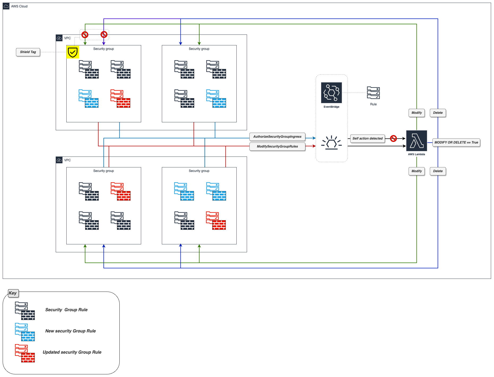

# lab-aws-security-group-watcher
<br><br>

## Diagram


## Info
The following project deploys solution that monitors security groups and changes rules that allowing unrestricted traffic from IP perspective (0.0.0.0/0).  

List of features:
- [ ] Change 0.0.0.0/0 with custom CIDR defined in config file
- [ ] Support for two types of action: modify only or modify or delete to solve issue with self-locking
- [ ] Support for ShieldTag to protect security groups that cannot be modified
- [ ] Self action detection to avoid loops
- [ ] YAML or JSON formatted config file to update solution parameters without changing terraform code

<br><br>

### ShieldTag
This feature allows to protect security groups that must remain untouched in any condition. To use it, **Active** must be set to ***True***, and security group must have exactly the same key/value tag assigned.

### Modify_or_Delete
As each rule inside security group must be unique, it's possible to lock the solution using following schema:
- step #1: User creates rule X with 0.0.0.0/0 as source
- step #2: Solution updates rule created in step #1 by replacing 0.0.0.0/0 with custom CIDR
- step #3: User creates identical rule as in step #1
- step #4: Solution tries to update rule created in step #3 but as it would create identical rule to step #2, action ends with an error

To solve this problem, the solution (when it's not possible to modify rule) deletes it.

To enable behaviour described above, set **Modify_or_Delete** to ***True***, if set to ***False***, the solution will leave rule that cannot be modified as it is.

### Self action detection
Solution detects rule's change and provide update using the same method. "Change to change is still a change" ;) , so it's important to track self-action to avoid loops. 
Everytime when solution detects self-action, will stop and log this case with ***"Self action detected, quitting ..."***

<br><br>

## Config file structure

It's expected that config file will be stored in config.yaml or config.json file with corresponding format. In case where both files exist, YAML will be prefered one.


### YAML format
<br>

```yaml
Parameters:

  DeploymentPrefix: "Rki-LAB"

  Region: eu-central-1


  AuthTags:
    Owner: "change@me.invalid"
    Env: Dev
    Deployment-method: TFE
    Other_key: Other_value

  Updated_CIDR: "10.10.10.0/24"
  Modify_or_Delete: True

  ShieldTag:
    Active: True
    Key: "alfa"
    Value: "beta"
```
<br><br>

### JSON format
<br>

```json
{
  "Parameters": {
    "DeploymentPrefix": "Rki-LAB",
    "Region": "eu-central-1",
    "AuthTags": {
      "Owner": "change@me.invalid",
      "Env": "Dev",
      "Deployment-method": "TFE",
      "Other_key": "Other_value"
    },
    "Updated_CIDR": "10.10.10.0/24",
    "Modify_or_Delete": true,
    "ShieldTag": {
      "Active": true,
      "Key": "alfa",
      "Value": "beta"
    }
  }
}
```
<br><br>

### Parameters description

- [ ] ***DeploymentPrefix***: prefix to be added to the name of every deployed resource for easy identification. It can be also used to achieve the uniqueness of multiple deployments inside a single account/region

- [ ] ***Region***: deployment region, used in AWS provider config 

- [ ] ***AuthTags***: additional tags to be added to lambda function

- [ ] ***UpdatedCIDR***: CIDR that will be used to replace 0.0.0.0/0

- [ ] ***Modify_or_Delete***: Define solution's behavior in case when rule cannot be modified 

- [ ] ***ShieldTag->Active***: If True, solution will not provide any changes in security tagged security groups

- [ ] ***ShieldTag->Key***: Key for ShieldTag

- [ ] ***ShieldTag->Value***: Value for ShieldTag

<br><br>
